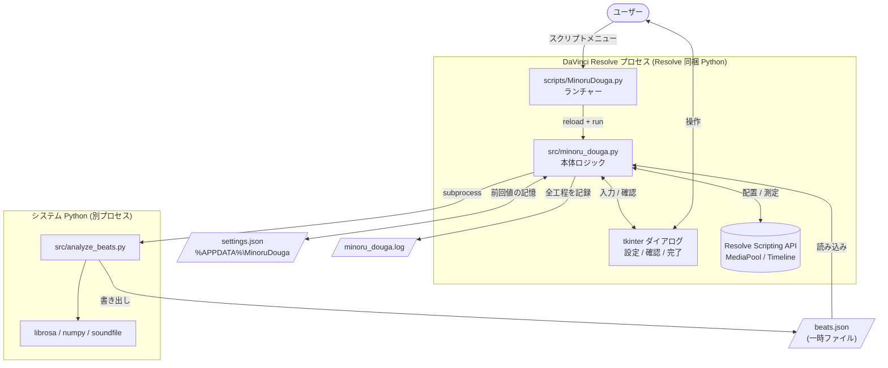
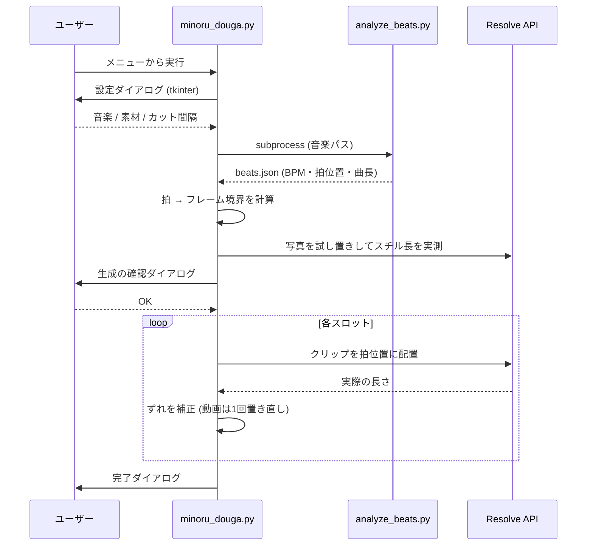

# アーキテクチャ

MinoruDouga の設計と、その背景にある判断をまとめる。
DaVinci Resolve のスクリプト API には文書化されていない制約が多く、
構成の大半は「動かして分かった制約」への対応で決まっている。

## 全体像

## 2 プロセス構成 — なぜビート解析を分離したか

ビート解析(librosa)は **Resolve とは別のシステム Python** で動かし、
結果を `beats.json` というファイル経由で受け渡す。

- Resolve 同梱の Python には librosa を入れられない / 入れたくない
  (環境を汚す・バージョン衝突)。
- `find_python()` が WindowsApps の Store スタブを除外しつつ、
  librosa の入った Python (`py` ランチャー等)を探して `subprocess` で呼ぶ。
- 疎結合なので `analyze_beats.py` は単体 CLI としても実行・テストできる。

## モジュール構成

| ファイル | 役割 |
|---|---|
| `scripts/MinoruDouga.py` | Resolve のスクリプトフォルダに置くランチャー。本体を毎回 `reload` するので、本体を編集しても Resolve 再起動不要。ログ初期化も担当 |
| `src/minoru_douga.py` | 本体。設定・ビート解析呼び出し・カット計算・タイムライン生成・UI を含む |
| `src/analyze_beats.py` | librosa でビート解析し JSON を吐く独立 CLI |
| `install.ps1` | 依存インストール + ランチャー配置 |

### `src/minoru_douga.py` の内部

| 区分 | 関数 | 要点 |
|---|---|---|
| 設定の保存 | `load_settings` / `save_settings` | 前回の入力を `%APPDATA%\MinoruDouga\settings.json` に記憶 |
| ビート解析 | `find_python` / `analyze` | システム Python を探し `analyze_beats.py` を subprocess 実行 |
| 素材スキャン | `scan_media` | 拡張子で写真 / 動画を収集 |
| カット計算 | `beat_points` | 拍位置(秒)→ タイムラインのフレーム境界へ変換 |
| タイムライン生成 | `build` | 中核。インポート → スチル長実測 → 確認 → 配置 → 検証 |
| UI | `show_dialog_tk` / `show_message_tk` | tkinter 製の設定 / メッセージ |
| エントリ | `run` | 全体の進行制御とロギング |

## 主要な設計判断(と踏んだ地雷)

このプロジェクトの構成は、Resolve API の癖への対応がそのまま形になっている。

### 1. UI は tkinter で作る(Resolve の UIManager は使わない)
無償版 Resolve はスクリプトから `fusion.UIManager` に触れると
Studio 宣伝ダイアログが出て `None` を返す。そのため UI は Python 標準の
tkinter で実装している(`show_dialog` / `show_message` は UIManager 版の
名残で未使用)。

### 2. 種別判定は拡張子で行う(`Type` プロパティは使わない)
クリップの `Type` プロパティは UI 言語でローカライズされる
(日本語版では「ビデオ」)。`"Video"` 判定が効かず全クリップが写真扱いに
なるバグを踏んだ。判定はファイル拡張子(`item_is_video`)で行う。

### 3. 写真は 1 枚ずつインポートする
連番ファイル名(`IMG_0388.JPG`, `0389`, ...)をまとめて渡すと、Resolve が
画像シーケンスとして 1 クリップに統合してしまう。1 枚ずつ `ImportMedia` で
回避する。

### 4. スチル長は「実測」する(プロパティからは読めない)
「標準スチルの長さ」設定はタイムラインに置く瞬間に適用され、メディアプール
上のプロパティ(`Frames` は常に 1)からは読めない。`probe_still_len()` で
写真を 1 枚試し置きして実測し、すぐ削除する。この設定は API から変更でき
ないため、不足時はダイアログでジャスト値(フレーム単位)を案内する。

### 5. 実行ごとに専用ビンへインポートする
同じファイルを同じビンに再インポートすると、Resolve は既存クリップを返す
(設定変更が反映されない)。`fresh_bin()` で実行ごとにサブフォルダを作り、
取り込み直しを確実にする。

### 6. 配置後に長さを実測して補正する
fps 換算の丸め(例: 30fps 素材を 24fps タイムラインへ)で数フレームずれる。
配置 → `GetDuration()` で実測 → ずれていれば動画は 1 回だけ置き直す。
ビート揺らぎ由来の ±1 フレームは正常範囲として許容する。

### 7. 動画のハイライトは In/Out 点で受け取る
ソースビューアで打った In/Out 点を `GetMarkInOut()` で読み、その範囲を使う。
Resolve ユーザーの自然な操作に乗せることで、専用 UI を増やさない。

## ログとデバッグ

全工程は `minoru_douga.log`(リポジトリ直下)に追記される。
ランチャーが `run(globals(), log_file=...)` を渡し、本体の `log()` が
コンソールとファイルの両方へ出力する。API の挙動が不透明なので、
インポート数・スチル長プローブ結果・長さ不一致などを逐一記録している。

## 既知の制約 / 今後

- 写真は「標準スチルの長さ」設定に依存するため、カット間隔を変えると
  設定し直しが必要(ダイアログがジャスト値を案内する)。
- 拡張候補: 曲の盛り上がり(RMS / オンセット強度)に応じた緩急カット、
  ハイライト区間の自動検出、トランジション自動挿入。
