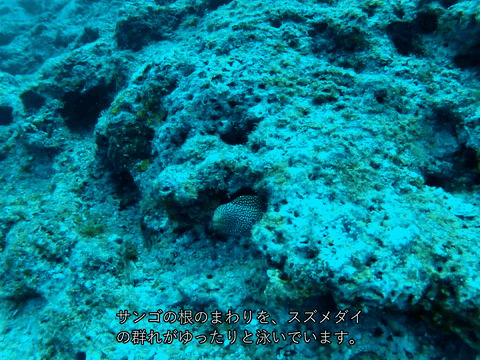
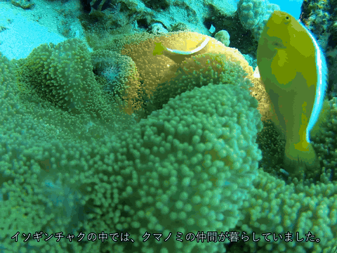
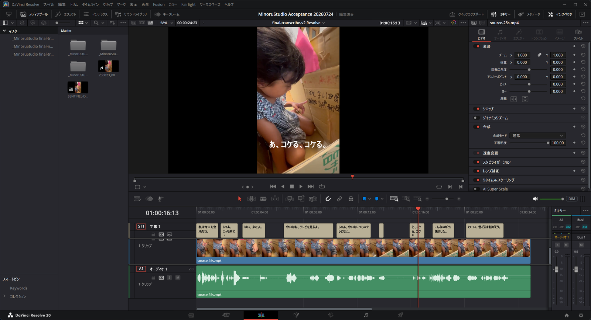

# MinoruStudio

MinoruStudioは、音ハメ・文字起こし・読み上げ(ナレーション)を扱う
Windows向けローカル動画制作ツールです。MinoruDouga(音ハメ単機能)の後継として、
その機能を包含しています。

- **音ハメ(beat-sync)** — BGMを解析し、静止画・動画をビートに合わせてカットした
  タイムラインを DaVinci Resolve 上に自動生成
- **文字起こし(transcribe)** — ローカルの FFmpeg + faster-whisper で字幕
  (`srt` / `vtt`)と字幕付きプレビューを生成。外部サービスへの送信なし
- **読み上げ(narrate)** — 人が承認した台本から、ローカル VOICEVOX で
  ナレーション音声と字幕を生成

成果物は2通りに使えます。字幕・ナレーションを合成済みの `preview.mp4` を
**そのまま出力して完結**させるか、動画編集ソフト
[DaVinci Resolve](https://www.blackmagicdesign.com/jp/products/davinciresolve)
(無償版で動作)へ**通常のタイムラインとして適用**して細部を微修正するかを
選べます。各処理は入力と結果を `.media-job` として確定させ、Resolve適用時も
既存タイムラインは上書きしません。

## デモ

編集済みの動画と台本を渡すと、VOICEVOXナレーションと字幕を合成した
`preview.mp4` が生成されます(`narrate -Preview`)。





ナレーション音声付きの完全版(25秒):
[img/demo-narrate.mp4](img/demo-narrate.mp4)

### DaVinci Resolveで微修正する

`preview.mp4` で完結させる代わりに、ジョブを DaVinci Resolve へ適用すると
通常のタイムラインが生成されます。字幕は字幕トラックのクリップになるため、
文言・タイミング・見た目を Resolve の標準UIでそのまま編集できます。



## 開発環境

```powershell
uv sync --locked --dev
uv run pytest -q
```

## 最短手順

最初にadapterとResolve Utility launcherを配置します。

```powershell
.\install.ps1
```

1. 下記CLIまたは引数なしGUIで音ハメjobを準備する
2. Resolveで適用先プロジェクトを開く
3. **ワークスペース → スクリプト → MinoruStudio** を開く
4. `succeeded` の `.media-job` を選び、素材を取り込む
5. 動画がある場合はapplication binの動画へIn/Outを設定し、MinoruStudioを再実行する
6. 指示された場合だけResolveの標準スチル長を変更し、再測定する
7. 最終確認を承認し、新規timelineのA1、V1、青markerを確認する

既存timelineは上書きせず、同名なら `-002` 以降の連番を付けます。処理記録は
各jobの `resolve/applications` と `logs/resolve.log` に保存されます。

## 音ハメjobを準備する

```powershell
uv run minoru-studio beat-sync `
  -Music .\song.mp3 `
  -MediaDir .\media `
  -EveryN auto `
  -Order asc `
  -TimelineName "Beat Sync Demo" `
  -Name demo `
  -OutputDir .\jobs
```

`-EveryN` は `auto` または1〜16、`-Order` は `asc` または `random` を
指定します。同名jobが存在する場合は連番の新規jobを作り、既存jobを
上書きしません。

成功すると `.media-job/outputs/beat-sync-plan.json` が作成されます。BGMの
長さ、ビート、カット位置はすべて非負の整数ミリ秒で保存されるため、CLIと
Resolve内アダプターの境界で小数秒の解釈差が生じません。

中断した準備は次のコマンドで再開できます。入力ファイルが変更されている
場合は安全のため停止します。

```powershell
uv run minoru-studio beat-sync resume .\jobs\demo.media-job
```

## GUI

```powershell
uv run minoru-studio
```

引数なしでランチャーを開きます。BGM、素材フォルダ、カット間隔、並び順、
タイムライン名を指定すると、解析はバックグラウンドで実行されます。前回の
入力値は `%APPDATA%\MinoruStudio\config.json` に保存されますが、許可された
画面項目以外は保存しません。

## 文字起こし

文字起こしはサポート対象のローカル workflow です。ローカルの FFmpeg と
faster-whisper を使い、入力メディア・ジョブ・生成物を外部サービスへ送信しません。
初回に model が cache にない場合も、`-AllowModelDownload` を明示しない限り
download は開始しません。

```powershell
uv run minoru-studio transcribe .\sample.mp4 `
  -Name demo-transcribe `
  -OutputDir .\jobs `
  -Preview

# 未キャッシュ model を使う場合だけ、利用者が明示して追加する
uv run minoru-studio transcribe .\sample.mp4 `
  -Name demo-transcribe `
  -OutputDir .\jobs `
  -Preview `
  -AllowModelDownload

uv run minoru-studio transcribe resume .\jobs\demo-transcribe.media-job
```

引数なし GUI (`uv run minoru-studio`) ではモードを `transcribe` にして、入力動画・
音声、model(`small` / `medium`)、language、音量正規化、ノイズ軽減、字幕付き
preview を選択します。失敗または中断した job は同じ画面で開いて再開できます。

成功すると `.media-job/outputs/` に `transcript.txt`、`subtitles.srt`、
`subtitles.vtt`、および video 入力で要求した場合の `preview.mp4` が作られます。
model cache は既定で `%LOCALAPPDATA%\MinoruStudio\models\faster-whisper` に置かれます。
入力は job manifest の fingerprint と照合し、変更されていれば再開を拒否します。
audio-only 入力には `-Preview` を指定できず、推論前に停止します。

環境を確認するには次を実行します。`doctor` は FFmpeg、FFprobe、faster-whisper のほか、
Python、PowerShell、uv も確認します。

```powershell
uv run minoru-studio transcribe --help
uv run minoru-studio doctor --json
```

## 読み上げ(narrate)

人が承認した台本から、ローカル VOICEVOX でナレーション音声と字幕を生成します。
VOICEVOX は利用者が事前に起動しておくローカル HTTP API(`127.0.0.1:50021`)だけを
使用し、MinoruStudio と Resolve アダプターが VOICEVOX を起動することはありません。
外部サービスへの送信も行いません。

この仕様は次の3原則に基づいています。

- **内容は人が決める** — 台本の自動リライト・短縮・話速調整はしない。
  ナレーションが動画より長くても警告するだけで、自動では縮めない
- **データは外に出さない** — 私的な素材を扱う前提のため、処理はローカルで完結する
- **ツールは勝手なことをしない** — VOICEVOX の自動起動・自動インストールはせず、
  未起動なら起動方法を案内して停止する

```powershell
uv run minoru-studio narrate .\sample.mp4 `
  -Script .\approved-script.txt `
  -Name demo-narrate `
  -OutputDir .\jobs `
  -Preview

uv run minoru-studio narrate resume .\jobs\demo-narrate.media-job
```

成功すると `.media-job/outputs/` に `narration.wav`、`subtitles.srt`、
`subtitles.vtt`、および video 入力で `-Preview` を指定した場合の `preview.mp4` が
作られます。

## Resolveで文字起こし・読み上げを適用する

単独で視聴・配布できる成果物が目的なら、`-Preview`(または GUI の preview 選択)で
`preview.mp4` を作れば完結します。この経路に Resolve は不要です。字幕の文言・
タイミング・見た目まで編集したい場合だけ、次の任意編集経路を使います。

1. **ワークスペース → スクリプト → MinoruStudio** で、成功済みの video
   `transcribe` / `narrate` ジョブを選択します。
2. 配置内容はモードごとに固定です。`transcribe` は V1=元動画、A1=同じ元動画の
   音声。`narrate` は V1=元動画、A1=`outputs/narration.wav`。
3. Utility は `<job name> Resolve`(既存名と衝突する場合は `-002`)の新規
   タイムラインを作ります。既存タイムラインのレンダー・置換・削除は行いません。
4. 案内に表示される検証済み `outputs/subtitles.srt` を Resolve 標準UIで字幕
   トラックへ手動インポートし、編集可能なことを確認したら、Utility を再実行して
   `字幕読み込みを確認` を押します。
5. アダプターは字幕の自動生成(`CreateSubtitlesFromAudio` 等)を行わず、
   `preview.mp4` を配置素材として使いません。

## 基盤コマンド

```powershell
uv run minoru-studio --version
uv run minoru-studio doctor --json
uv run minoru-studio jobs create -Mode beat-sync -Name demo -OutputDir .\jobs
uv run minoru-studio jobs inspect .\jobs\demo.media-job
uv run minoru-studio
```

`jobs create` は各固定モードの空の `pending` jobを作る基盤コマンドです。
音ハメ準備には上記の専用 `beat-sync` コマンドまたはGUIを使用してください。

Resolveへ適用するときは、準備済みjobを選んで必ず最終確認を承認します。
途中のIn/Out設定やスチル長変更が必要な場合は状態をjobへ保存し、次のUtility
呼び出しから再開します。

## ライセンス

[MIT License](LICENSE)。依存ライブラリ(numpy / soundfile = BSD 3-Clause、
librosa = ISC)はいずれも寛容型ライセンス。
