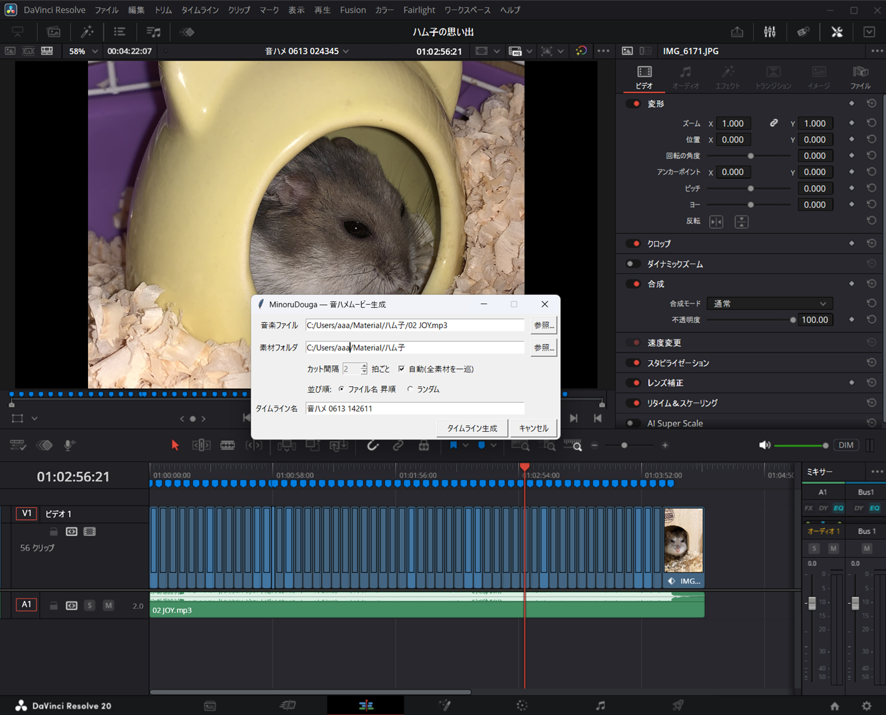

# MinoruStudio

MinoruStudioは、MinoruDougaの音ハメを包含し、字幕、読み上げ、リポジトリの
デモ動画制作などを段階的に扱うWindows向けローカル制作ツールです。

BGMを解析して静止画・動画の順序とカット位置を確定した `.media-job` を作り、
Resolve内アダプターから新しいタイムラインとして安全に適用できます。

## 開発環境

```powershell
uv sync --locked --dev
uv run pytest -q
```

## 最短手順

最初にadapterとResolve Utility launcherを配置します。

```powershell
.\install.ps1
```

1. 下記CLIまたは引数なしGUIで音ハメjobを準備する
2. Resolveで適用先プロジェクトを開く
3. **ワークスペース → スクリプト → MinoruStudio** を開く
4. `succeeded` の `.media-job` を選び、素材を取り込む
5. 動画がある場合はapplication binの動画へIn/Outを設定し、MinoruStudioを再実行する
6. 指示された場合だけResolveの標準スチル長を変更し、再測定する
7. 最終確認を承認し、新規timelineのA1、V1、青markerを確認する

既存timelineは上書きせず、同名なら `-002` 以降の連番を付けます。処理記録は
各jobの `resolve/applications` と `logs/resolve.log` に保存されます。

## 音ハメjobを準備する

```powershell
uv run minoru-studio beat-sync `
  -Music .\song.mp3 `
  -MediaDir .\media `
  -EveryN auto `
  -Order asc `
  -TimelineName "Beat Sync Demo" `
  -Name demo `
  -OutputDir .\jobs
```

`-EveryN` は `auto` または1〜16、`-Order` は `asc` または `random` を
指定します。同名jobが存在する場合は連番の新規jobを作り、既存jobを
上書きしません。

成功すると `.media-job/outputs/beat-sync-plan.json` が作成されます。BGMの
長さ、ビート、カット位置はすべて非負の整数ミリ秒で保存されるため、CLIと
Resolve内アダプターの境界で小数秒の解釈差が生じません。

中断した準備は次のコマンドで再開できます。入力ファイルが変更されている
場合は安全のため停止します。

```powershell
uv run minoru-studio beat-sync resume .\jobs\demo.media-job
```

## GUI

```powershell
uv run minoru-studio
```

引数なしでランチャーを開きます。BGM、素材フォルダ、カット間隔、並び順、
タイムライン名を指定すると、解析はバックグラウンドで実行されます。前回の
入力値は `%APPDATA%\MinoruStudio\config.json` に保存されますが、許可された
画面項目以外は保存しません。

## 文字起こし（0.3.0受入前）

この機能は実モデル受入前の pre-release です。ローカルの FFmpeg と
faster-whisper を使い、入力メディア・ジョブ・生成物を外部サービスへ送信しません。
初回に model が cache にない場合も、`-AllowModelDownload` を明示しない限り
download は開始しません。

```powershell
uv run minoru-studio transcribe .\sample.mp4 `
  -Name demo-transcribe `
  -OutputDir .\jobs `
  -Preview

# 未キャッシュ model を使う場合だけ、利用者が明示して追加する
uv run minoru-studio transcribe .\sample.mp4 `
  -Name demo-transcribe `
  -OutputDir .\jobs `
  -Preview `
  -AllowModelDownload

uv run minoru-studio transcribe resume .\jobs\demo-transcribe.media-job
```

引数なし GUI (`uv run minoru-studio`) ではモードを `transcribe` にして、入力動画・
音声、model（`small` / `medium`）、language、音量正規化、ノイズ軽減、字幕付き
preview を選択します。失敗または中断した job は同じ画面で開いて再開できます。

成功すると `.media-job/outputs/` に `transcript.txt`、`subtitles.srt`、
`subtitles.vtt`、および video 入力で要求した場合の `preview.mp4` が作られます。
model cache は既定で `%LOCALAPPDATA%\MinoruStudio\models\faster-whisper` に置かれます。
入力は job manifest の fingerprint と照合し、変更されていれば再開を拒否します。
audio-only 入力には `-Preview` を指定できず、推論前に停止します。

環境を確認するには次を実行します。`doctor` は FFmpeg、FFprobe、faster-whisper のほか、
Python、PowerShell、uv も確認します。

```powershell
uv run minoru-studio transcribe --help
uv run minoru-studio doctor --json
```

実モデルの受入手順と記録欄は [文字起こし受入 runbook](docs/transcribe-acceptance.md) を
使用してください。この README は受入完了や 0.3.0 の提供開始を宣言するものではありません。

## 基盤コマンド

```powershell
uv run minoru-studio --version
uv run minoru-studio doctor --json
uv run minoru-studio jobs create -Mode beat-sync -Name demo -OutputDir .\jobs
uv run minoru-studio jobs inspect .\jobs\demo.media-job
uv run minoru-studio
```

`jobs create` は各固定モードの空の `pending` jobを作る基盤コマンドです。
音ハメ準備には上記の専用 `beat-sync` コマンドまたはGUIを使用してください。

Resolveへ適用するときは、準備済みjobを選んで必ず最終確認を承認します。
途中のIn/Out設定やスチル長変更が必要な場合は状態をjobへ保存し、次のUtility
呼び出しから再開します。

---

## Legacy fallback

既存のMinoruDougaは自動アンインストールされません。導入済み環境では、従来の
**ワークスペース → スクリプト → MinoruDouga** も引き続き利用できます。

### MinoruDouga 🎵🎬

写真・動画・音楽を渡すと、曲のビートに合わせてテンポよくカットした
タイムラインを DaVinci Resolve 上に自動生成するツール。
生成後は普通のタイムラインなので、そのまま Resolve で微調整できる。



> 設定ダイアログで音楽・素材フォルダ・カット間隔を指定すると、ビートに
> 合わせてカットされたタイムラインが生成される(各カット位置に青マーカー)。

### 仕組み

```
音楽ファイル ──→ analyze_beats.py (librosa でビート解析・システム Python)
                        │ beats.json
                        ▼
Resolve スクリプトメニュー ──→ minoru_douga.py
   ├ 素材フォルダの写真・動画をメディアプールにインポート
   ├ 拍位置でカット境界を計算(N拍ごと)
   ├ V1 に素材を順番/ランダムに配置(動画は使用箇所を自動でずらす)
   ├ A1 に音楽を配置
   └ 各カット位置にマーカーを追加
```

無償版 Resolve でも動く(外部からの API 操作ではなく、Resolve 内の
スクリプトメニューから実行する方式のため)。

### セットアップ

現在の `.\install.ps1` はMinoruStudioを配置します。既存の
`MinoruDouga.py` は削除・上書きしないため、導入済み環境のlegacy fallbackは
そのまま残ります。

### 使い方

1. 素材(写真・動画)を 1 つのフォルダにまとめる
2. Resolve でプロジェクトを開く
3. メニュー **ワークスペース → スクリプト → MinoruDouga**
4. ダイアログで音楽ファイル・素材フォルダ・カット間隔(N拍ごと)を指定して「タイムライン生成」

ログは **ワークスペース → コンソール** に出る。

### オプション

| 項目 | 説明 |
|---|---|
| カット間隔 | 何拍ごとに切り替えるか。「自動」は全素材がほぼ一巡する間隔を計算 |
| 並び順 | ファイル名 昇順 / ランダム |

### 動画のハイライト指定

使ってほしい場面がある動画は、実行前に **メディアプールでダブルクリック →
ソースビューアでその場面の頭に In 点(`I`)を打つだけ**でよい。
長さはスクリプトが拍数に合わせて自動で決めるので Out 点は不要。
Out 点(`O`)も打った場合は「この範囲の中だけを使う」という制限になる。
未指定の動画は全体から順繰りに使われる。

設定は `%APPDATA%\MinoruDouga\settings.json` に記憶される。

### 注意・既知の制限

- **対応音楽形式**: wav / flac / mp3 / ogg。m4a・aac は ffmpeg が必要
  (`winget install Gyan.FFmpeg`)
- **写真の表示時間**: Resolve の環境設定「標準スチルの長さ」(環境設定 →
  ユーザー → 編集 → 一般設定)がスロット長より短いと写真を引き伸ばせない。
  実行時に自動チェックし、足りない場合は変更手順をダイアログで案内する
- **Resolve の Python**: Resolve はシステムの Python 3 を使う。メニューに
  スクリプトが出ない・動かない場合は Resolve が Python を認識しているか確認
  (Preferences → System → General の Script 設定)
- クリップが毎回 1 フレームずれる場合は `src/minoru_douga.py` の
  `END_FRAME_INCLUSIVE` を反転させる

### 開発メモ

- 本体: [src/minoru_douga.py](src/minoru_douga.py) — ランチャー経由で毎回 reload されるので、編集が即反映される
- ビート解析: [src/analyze_beats.py](src/analyze_beats.py) — 単体でも実行可能
- 設計の全体像と判断の背景は [ARCHITECTURE.md](ARCHITECTURE.md) を参照
- 今後の拡張候補: 曲の盛り上がり(RMS/オンセット強度)に応じた緩急カット、
  ハイライト区間の自動検出、トランジション自動挿入

## ライセンス

[MIT License](LICENSE)。依存ライブラリ(numpy / soundfile = BSD 3-Clause、
librosa = ISC)はいずれも寛容型ライセンス。
