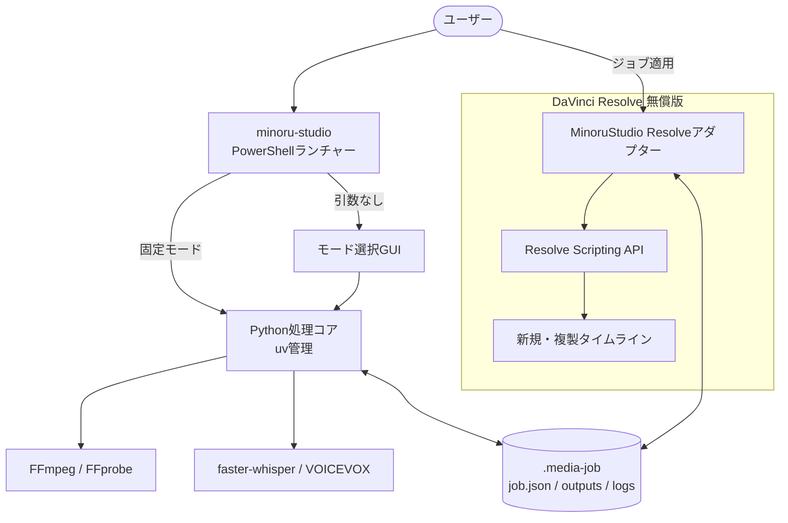

# MinoruStudio 総合動画制作ツール設計

## 1. ステータス

- 本書は設計のみを対象とする。
- ツール実装、依存関係の追加、インストール、モデル取得、クラウドAPI呼び出しは本書の更新範囲に含めない。
- MinoruStudioは、既存MinoruDougaの音ハメ機能を包含し、音声認識、字幕、読み上げ、台本下書きを扱う新しい個人用ローカルツールとする。
- 対象OSはWindowsとし、DaVinci Resolve無償版への対応を必須とする。
- 現行MinoruDougaは移植元として保持し、実装開始までは `src/`、`scripts/`、`install.ps1`、依存関係を変更しない。
- GitHubリモートとの互換性や公開リポジトリへの同期は設計対象外とし、このローカルリポジトリで設計を進める。

## 2. 目的

動画制作の独立した作業を、再現可能な固定モードとして自動化する。

1. 選択したBGMに静止画・動画を音ハメし、編集可能なResolveタイムラインを作る。
2. 音声付き動画から文字起こしと字幕を作る。
3. 台本からVOICEVOX音声と同期字幕を作る。
4. 画面録画を含む動画から台本作成用の代表フレームを作る。

元動画や既存タイムラインは保持する。CLI側は編集可能なファイル成果物を作るところまでを標準とし、Resolveへの適用はユーザーが明示的に実行する。

## 3. 対象外

初期版では次を行わない。

- 複数モードを任意の順序で接続する汎用ワークフローエンジン
- Web、デスクトップ、モバイルアプリの自動操作・自動録画
- DaVinci Resolve Studio専用の外部スクリプト制御
- OpenAI APIへの直接接続
- Voicemod、Voicemeeter、仮想オーディオ経路
- macOSおよびLinux対応
- Resolveからの最終レンダー完全自動化

これらは基本経路の安定後に、独立した追加機能として検討する。

## 4. 設計原則

### 4.1 固定モード

利用者向け機能は固定モードとして分離する。内部処理は共有してよいが、初期版では利用者が任意の工程グラフを構築する機能を持たせない。

### 4.2 ファイル成果物を先に作る

音声、字幕、台本、解析結果をResolveなしで作れるようにする。Resolveアダプターは完成済み成果物を読み、タイムラインへ適用する責任だけを持つ。

### 4.3 外部送信を行わない

現行の固定モードはすべてローカルで処理し、外部送信を行わない。

### 4.4 元データを変更しない

入力動画、BGM、素材、台本、既存タイムラインを自動で上書きまたは削除しない。設定や入力が変わった処理は新しいジョブとして作成する。

## 5. 採用アーキテクチャ

PowerShellランチャー、隔離されたPython処理コア、FFmpeg、Resolve内アダプターをジョブパッケージで接続する。



### 5.1 コンポーネント

- **PowerShellランチャー**: `minoru-studio` コマンドを提供し、ツール専用Pythonを起動する。
- **ランチャーGUI**: 引数なし起動時に、ジョブ作成、既存ジョブ、固定モード選択、ファイル選択、実行前確認を提供する。
- **Python処理コア**: ジョブ管理、入力検査、モード処理、プロバイダー制御、成果物検証を担当する。
- **FFmpeg / FFprobe**: 音声抽出、連結、字幕焼き込み、代表フレーム、確認用MP4、ストリーム検査を担当する。
- **プロバイダー**: faster-whisper、VOICEVOXを共通処理から分離する。
- **Resolveアダプター**: Resolve内で動く薄いスクリプトとし、外部Python依存をResolve環境へ読み込まない。
- **ジョブパッケージ**: CLI、GUI、処理コア、Resolveアダプターの唯一の受け渡し形式とする。

### 5.2 配置方針

- コマンド: `minoru-studio`
- アプリ本体と専用Python環境: `%LOCALAPPDATA%\MinoruStudio\`
- 設定: `%APPDATA%\MinoruStudio\config.json`
- モデルキャッシュ: `%LOCALAPPDATA%\MinoruStudio\models\`
- Resolveアダプター: Resolveのユーザー別 `Fusion\Scripts\Utility` 配下
- Python: `uv` 管理のツール専用環境

Pythonや依存ライブラリをResolve同梱PythonやシステムPythonへ直接インストールしない。

## 6. CLIとGUI

### 6.1 GUI起動

```powershell
minoru-studio
```

引数なしでは次のGUIを開く。

1. 「新しいジョブ」または「既存ジョブを開く」
2. 固定モードを選択
3. ファイルと設定を入力
4. 事前検査と実行内容を確認
5. ジョブを作成して実行
6. 成果物とResolve適用手順を表示

GUIは薄い入力層とし、検証や処理ロジックを持たせない。

### 6.2 非対話CLI

```powershell
minoru-studio <mode> [options]
```

サブコマンドは非対話で動く。必須引数が不足した場合にGUIを開かず、エラーと使用方法を返す。

現行の非対話CLIは外部送信を行わない。

## 7. 固定モード

### 7.1 `beat-sync`

```powershell
minoru-studio beat-sync -Music song.mp3 -MediaDir .\media
```

CLI側の処理:

1. BGMと素材一覧を検査する。
2. librosaでBGMのBPM、拍位置、長さを解析する。
3. 拍位置を整数ミリ秒でジョブへ保存する。
4. 素材一覧、並び順、拍間隔、タイムライン名を保存する。
5. Resolveで適用可能な状態にする。

Resolve側の処理:

1. ジョブ専用ビンへBGMと素材をインポートする。
2. 必要ならユーザーが動画へIn/Out点を指定できるよう一時停止する。
3. 現在のタイムラインFPS、動画のソースFPS、In/Out点、スチル長を読み取る。
4. ミリ秒の拍位置をタイムラインフレームへ変換する。
5. 配置計画と必要なスチル長を表示して確認する。
6. 新しいタイムラインへBGM、静止画、動画、拍マーカーを配置する。
7. 配置後の実時間を測定し、動画のFPS換算によるずれを一度だけ補正する。

現行MinoruDougaから次の動作を移植する。

- 拡張子による写真・動画判定
- 写真の個別インポート
- 専用ビンへの再インポート
- スチル長の実測とジャスト値案内
- In/Out点を利用したハイライト指定
- 素材ごとの使用位置と使用回数管理
- 配置後の長さ実測と補正
- ビート揺らぎ由来の±1フレーム許容

### 7.2 `transcribe`

```powershell
minoru-studio transcribe input.mp4
```

1. FFmpegで音声トラックを抽出する。
2. 指定時だけ保守的な音量正規化とノイズ低減を行う。
3. faster-whisperで文字起こし、VAD、タイムスタンプ生成を行う。
4. TXT、SRT、VTTを生成する。
5. 明示オプション時だけ、字幕を焼き込んだ確認用MP4を生成する。

既定モデルはCPU負荷と日本語精度の均衡から `small`、既定計算はCPU INT8とする。`medium` を明示選択できるようにする。

### 7.3 `narrate`

```powershell
minoru-studio narrate input.mp4 -Script script.txt
```

1. 台本を句読点と最大文字数で発話単位に分割する。
2. VOICEVOXで発話単位ごとのWAVを生成する。
3. FFprobeで各WAVの実時間を取得する。
4. 発話間の間隔を含めてWAVを連結する。
5. 実時間からSRTとVTTを生成する。
6. Resolveへ適用可能な音声・字幕成果物を保存する。
7. 明示オプション時だけ確認用MP4を生成する。

音声が元動画より長くても、自動で速度変更、切り捨て、台本短縮をしない。成果物を保持して警告する。

### 7.4 `script-draft`

```powershell
minoru-studio script-draft input.mp4
```

1. シーン変化と時間間隔から代表フレームを抽出する。
2. フレーム、時刻、解像度を記録する。
3. 人が記入できる台本テンプレートを作る。

初期版では画像を外部へ送らず、ローカル画像モデルも同梱しない。

## 8. ジョブパッケージ

既定のジョブディレクトリ名は `<job-name>.media-job` とする。保存先はGUIまたは `-OutputDir` で指定できる。

```text
<job-name>.media-job/
  job.json
  inputs/
  outputs/
    beats.json
    transcript.txt
    subtitles.srt
    subtitles.vtt
    narration.wav
    preview.mp4
  work/
  logs/
    run.log
  resolve/
    apply-result.json
```

モードに不要なファイルやディレクトリは作らなくてよい。

### 8.1 `job.json`

次を記録する。

- スキーマバージョン、ジョブID、固定モード
- 作成日時、更新日時、ジョブ状態
- 入力ファイルの正規化済み絶対パス、サイズ、更新日時、SHA-256
- モード固有設定
- 整数ミリ秒のタイムスタンプ
- 各処理段階の状態
- 使用したツール、モデル、プロバイダー、バージョン
- 外部プロセスの終了コード
- 生成物のパス、ハッシュ、検査結果
- エラー要約
- Resolve適用状態

APIキー、個人情報、台本や字幕の本文はログ用フィールドへ複製しない。

### 8.2 入力の扱い

- 大きな動画、BGM、素材は複製せず参照する。
- 台本など、ジョブの再現に必要な小さな入力は `inputs/` へコピーする。
- 入力ハッシュと設定が一致する場合だけ成功済み工程を再利用する。
- 入力が変化した場合は再開せず、新しいジョブを作る。

### 8.3 上書き防止

- 元ファイルを変更しない。
- 同名ジョブがある場合は黙って置換しない。
- GUIでは「前回の続き」「完了済みジョブを開く」「新しいジョブを作る」「キャンセル」を選ばせる。
- 新しいジョブは `<name>-002.media-job` のように別名で作る。
- 同じジョブの再開では、失敗または未完了の工程だけを実行する。

### 8.4 状態更新

工程状態は `pending`、`running`、`succeeded`、`failed`、`interrupted` とする。

- `job.json` は一時ファイルへ書いてから置換する。
- 同一ジョブの同時実行をロックファイルで防ぐ。
- 異常終了で残った `running` は、次回起動時に `interrupted` として扱う。
- `work/` は失敗時の診断と再開に必要な間は保持する。

## 9. 時刻とフレーム

ジョブ内の共通時刻単位は整数ミリ秒とする。

```json
{
  "beats_ms": [502, 1007, 1511],
  "duration_ms": 18342
}
```

`beats_ms` には検出された拍だけを記録する。Resolveアダプターは配置境界を作る際に先頭の0msと曲末尾の `duration_ms` を加え、重複する境界を除外する。

Resolve適用時に、対象タイムラインのフレームレートを使ってフレーム番号へ変換する。

```text
frame = round(time_ms × fps_numerator / (1000 × fps_denominator))
```

23.976fpsや29.97fpsを浮動小数点の表示値だけで扱わず、可能な限り `24000/1001`、`30000/1001` のような有理数として扱う。最終的な配置精度はResolveの1フレーム単位とする。

現行MinoruDougaはlibrosaの拍位置を小数秒で保持し、`round(seconds × timeline_fps)` でフレーム化している。移植時は解析結果を整数ミリ秒へ正規化し、既存の配置結果と±1フレーム以内で一致することを検証する。

## 10. Resolveアダプター

### 10.1 起動

Resolveの「ワークスペース → スクリプト → MinoruStudio → ジョブ適用」から起動する。

DaVinci Resolve無償版では、CLIからResolveを直接操作する構成を前提にしない。Resolve内スクリプトを正式な適用経路とする。実装開始時に、使用中のResolveに同梱されたDeveloperドキュメントでAPIとライセンス制約を再確認する。

### 10.2 `beat-sync` の適用

1. `.media-job` を選択する。
2. ジョブ状態と入力ハッシュを検査する。
3. 専用ビンへ素材をインポートする。
4. 必要ならIn/Out点の指定待ちダイアログを表示する。
5. スチル長を実測する。
6. 配置計画を表示して確認する。
7. 新しいタイムラインを作る。
8. 配置、実測、補正、検証を行う。
9. 実際のフレーム位置を `resolve/apply-result.json` に記録する。

### 10.3 字幕・ナレーションの適用

- `transcribe` は字幕トラックを追加する。
- `narrate` は音声トラックと字幕トラックを追加する。
- 既定では現在のタイムラインを複製し、複製先へ適用する。
- 現在のタイムラインへ直接適用する場合は、明示選択と最終確認を必要とする。

### 10.4 重複適用

`apply-result.json` のプロジェクト、タイムライン、成果物ハッシュを照合する。同じジョブを同じタイムラインへ再適用しようとした場合は停止し、別タイムラインまたは新しいジョブを案内する。

## 11. プロバイダー

### 11.1 faster-whisper

- 既定はローカルCPU INT8、`small` モデル。
- VADで長い無音を除外する。
- セグメントまたは単語タイムスタンプからSRT/VTTを作る。
- 初回モデル取得前に、ネットワーク通信、推定容量、保存先を表示する。

### 11.2 VOICEVOX

- 初期版の既定読み上げエンジンとする。
- ローカルHTTP APIの `/audio_query` と `/synthesis` を利用する。
- 話者、スタイル、話速を指定可能にする。
- エンジンが起動していない場合は、起動方法を示して停止する。
- 別の読み上げプロバイダーへ黙って切り替えない。

### 11.3 後続プロバイダー

OpenAI API直接連携、クラウド音声認識、クラウドTTS、Voicemodは初期版へ含めない。追加する場合もプロバイダーアダプターとして分離し、明示指定と送信確認を必須とする。

## 12. プライバシーと安全性

- 現行の固定モードは動画、音声、画像を外部へ送らない。
- APIキー、VOICEVOX設定内の秘密情報をログへ出さない。
- 外部プロセスのコマンドラインを記録する場合、秘密値をマスクする。
- 元動画、台本、字幕、成功済み成果物を自動削除しない。

## 13. エラー処理と再開

- 起動時にPowerShell、ツール専用Python、FFmpeg、FFprobe、選択プロバイダーを検査する。
- 外部プロセスの終了コードが0でも、成果物が存在しない、空、破損、または検査不合格なら失敗とする。
- プロバイダー障害時に別サービスへ自動切り替えしない。
- キャンセル時は子プロセスを正常終了させ、必要なら強制終了する。元データと成功済み成果物は保持する。
- 入力ハッシュまたは設定が変化したジョブは再開しない。
- ナレーションが動画より長い場合は警告し、自動短縮しない。
- Resolve API処理は完全なロールバックを前提にしない。
- Resolve適用途中で失敗した場合、作成したビンやタイムラインを自動削除せず「未完成」と明示し、対象名を表示する。
- すべての必須外部プロセス、成果物検査、Resolve検査が成功した場合だけ完了扱いにする。

## 14. 検証方針

### 14.1 自動検証

- 固定モードごとのCLI引数
- 引数なしGUIと非対話CLIの境界
- `job.json` のスキーマ
- 24、30、60、23.976、29.97fpsのミリ秒・フレーム変換
- 台本分割、発話連結、SRT/VTT時刻の単調増加と重複防止
- Windowsの空白、日本語、長いパス
- 入力ハッシュ、上書き防止、ロック、失敗後の再開
- 既存出力と元ファイルの非変更
- ログへの秘密情報非出力
- faster-whisper、VOICEVOX、Resolve APIのモック
- 外部コマンド失敗時の失敗伝播
- FFprobeによる映像・音声ストリーム、長さ、容量の検査
- 同一ジョブのResolve重複適用防止

### 14.2 ローカル統合検証

- 合成クリック音と短い素材で音ハメ位置を確認する。
- Resolve無償版でIn/Out点、写真、動画、BGM、拍マーカーを確認する。
- 現行MinoruDougaと新 `beat-sync` の配置結果を比較する。
- 短い日本語音声でfaster-whisperのTXT、SRT、VTTを確認する。
- VOICEVOXで発話別WAV、結合音声、字幕同期を確認する。
- App Review用の短い実動画で、元動画を変更せず成果物を作れることを確認する。

## 15. 受入条件

- `minoru-studio` でGUIを開ける。
- PowerShellから各固定モードを非対話実行できる。
- 現行の固定モードは外部送信を行わない。
- 元ファイルと既存タイムラインを変更または削除しない。
- 音ハメ位置は期待位置から±1フレーム以内である。
- In/Out点がある動画は指定区間を優先する。
- `transcribe` と `narrate` はResolveなしで完了する。
- SRTとVTTを生成し、明示指定時に確認用MP4を生成できる。
- Resolve適用後もカット、音声、字幕を編集できる。
- プロバイダー障害時に黙ったフォールバックを行わない。
- 外部プロセスと成果物検査がすべて成功した場合だけ完了扱いにする。

## 16. 将来の実装順序

本節はロードマップであり、実装着手を意味しない。

本書は製品全体の傘設計であり、以下を一つの実装計画で同時に進めない。各段階の着手前に、その段階だけを対象とする詳細仕様、機械的な受入条件、実装計画を別途作成して承認する。

1. 共通基盤: ジョブスキーマ、CLI、GUI、ログ、再開、環境検査
2. `beat-sync`: 現行MinoruDouga機能の移植とResolveアダプター確立
3. `transcribe`: faster-whisperと字幕成果物
4. `narrate`: VOICEVOX、音声連結、字幕同期
5. Resolve連携とまとめて受入
6. 後続拡張: OpenAI API、Voicemod

既存MinoruDougaを最初の縦断テストとして利用し、基本動作を保ったまま段階的に移植する。

## 17. 残余リスク

- Resolve APIと無償版の挙動はバージョン差があるため、実装開始時と対応バージョン更新時に実機確認が必要である。
- Resolve処理はトランザクションではなく、途中失敗時に未完成のビンやタイムラインが残る。
- 23.976／29.97fpsやソースFPS変換では丸めが必要である。
- 写真はResolveの標準スチル長へ依存する。
- faster-whisperの日本語精度と実行時間は録音品質とCPUに依存する。
- VOICEVOXの実時間は話者、話速、台本分割で変化する。

## 18. 参考資料

- [FFmpeg documentation](https://ffmpeg.org/ffmpeg.html)
- [faster-whisper](https://github.com/SYSTRAN/faster-whisper)
- [VOICEVOX Engine](https://github.com/VOICEVOX/voicevox_engine)
- [VOICEVOX Engine API](https://voicevox.github.io/voicevox_engine/api/)
- [DaVinci Resolve Support Center](https://www.blackmagicdesign.com/support/)
- [DaVinci Resolve Scripting API documentation mirror](https://wiki.dvresolve.com/developer-docs/scripting-api)（参照用。実装時はResolve同梱資料を正とする）
- [librosa beat tracking](https://librosa.org/doc/latest/generated/librosa.beat.beat_track.html)
