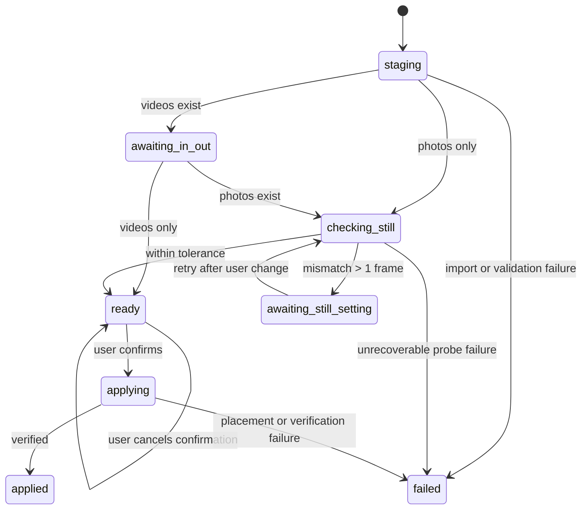

# MinoruStudio Phase 2: Beat Sync End-to-End Design

- Date: 2026-07-18
- Status: Draft for final document review
- Scope: Beat analysis through creation of a new DaVinci Resolve timeline
- Platform: Windows, DaVinci Resolve Free compatibility required

## 1. Context

Phase 1 established the MinoruStudio launcher, job package, locking, process
execution, logging, doctor checks, and integer-millisecond/rational-frame-rate
utilities. The existing MinoruDouga implementation remains the behavioral
reference for beat-synced photo and video placement.

Phase 2 migrates that behavior into the MinoruStudio architecture. It must keep
Resolve-specific work inside a thin Resolve adapter and keep beat analysis and
job preparation usable without Resolve.

The phase is complete only when a prepared beat-sync job can be explicitly
applied inside Resolve to create a new editable timeline containing the BGM,
photos, videos, and cut markers.

## 2. Goals

1. Create a beat-sync job from a selected BGM and a folder of photos and videos.
2. Persist all media time positions and durations outside Resolve as integer
   milliseconds.
3. Preserve the existing controls:
   - automatic or fixed 1-16 beat cut intervals;
   - case-insensitive filename order or random order;
   - a user-specified timeline name.
4. Preserve the useful existing placement behavior:
   - extension-based photo/video detection;
   - individual photo import to avoid accidental image sequences;
   - a dedicated bin per application attempt;
   - per-video source cursors and usage counts;
   - source In/Out support;
   - measured still duration and an exact recommended setting;
   - post-placement duration measurement and one video correction;
   - a one-timeline-frame tolerance.
5. Allow the Resolve workflow to stop for human In/Out and still-duration work,
   close, and resume later from durable state.
6. Never overwrite or silently delete source media, an existing job, an
   existing bin, or an existing timeline.

## 3. Non-goals

This phase does not include:

- editing an existing timeline;
- a manual per-material reorder UI;
- recursive media-folder scanning;
- final rendering or export automation;
- transitions, effects, reframing, or color operations;
- manual beat editing;
- transcription, narration, or repository-demo processing;
- external Resolve control that requires DaVinci Resolve Studio;
- removal of the legacy MinoruDouga sources or installed launcher.

## 4. Chosen Architecture

The chosen design is a job-driven state machine with a thin Resolve adapter.

### 4.1 External MinoruStudio core

The Python 3.12 core owns:

- CLI and launcher-GUI input;
- input validation and fingerprints;
- librosa beat analysis;
- conversion to integer milliseconds;
- material ordering and cut-plan preparation;
- job status, artifacts, and local logs.

It does not import, launch, or mutate Resolve.

### 4.2 Resolve adapter

The adapter runs from Resolve's Utility scripts menu and owns:

- selecting and validating a completed `.media-job`;
- importing BGM and materials into an application-specific bin;
- reading project/timeline and source frame rates;
- reading source In/Out marks;
- measuring the effective still duration;
- converting persisted milliseconds to timeline frames;
- creating and populating a new timeline;
- recording application state and placement results.

The adapter uses only Python 3.6-compatible standard-library code, Tkinter, and
the Resolve Scripting API. It does not import librosa or the Python 3.12
MinoruStudio package.

### 4.3 Boundary

The `.media-job` package is the only data boundary between the two runtimes.
The shared behavior is defined by versioned JSON contracts and contract tests,
not by importing the external core into Resolve.

The generic `job.status` describes Resolve-independent preparation. Resolve
application progress is tracked separately in `job.resolve_applications` and
per-attempt detail files.

## 5. Job Layout and Data Contract

The Phase 1 layout remains in use:

```text
example.media-job/
  job.json
  inputs/
  outputs/
    beat-sync-plan.json
  work/
  logs/
    run.log
    resolve.log
  resolve/
    applications/
      <attempt-id>.json
```

Inputs remain in their original locations. The job records an absolute path,
size, `mtime_ns`, and SHA-256 for the BGM and every accepted material.

### 5.1 Beat-sync plan

`outputs/beat-sync-plan.json` is the authoritative CLI-to-Resolve contract.
A representative shape is:

```json
{
  "schema_version": 1,
  "job_id": "uuid",
  "mode": "beat-sync",
  "audio_input_index": 0,
  "analysis": {
    "duration_ms": 123456,
    "bpm": 120.1,
    "beats_ms": [502, 1003, 1502],
    "cut_points_ms": [0, 502, 1003, 1502, 123456],
    "minimum_cut_ms": 150
  },
  "settings": {
    "every_n_requested": "auto",
    "every_n_resolved": 2,
    "order_mode": "random",
    "timeline_name": "Beat Sync Demo"
  },
  "materials": [
    {
      "input_index": 1,
      "kind": "photo",
      "order_index": 0
    }
  ]
}
```

The real arrays may be longer; the example is illustrative rather than a valid
musical analysis of the shown duration.

Rules:

- every field ending in `_ms` is a non-negative JSON integer;
- seconds represented as floating-point numbers are never persisted;
- `bpm` may be a finite positive number because it is not a time coordinate;
- `beats_ms` is strictly increasing and lies inside the BGM duration;
- `cut_points_ms` is strictly increasing, starts at zero, and ends at
  `duration_ms`;
- adjacent cut points are at least `minimum_cut_ms` apart;
- material input indices refer to `job.json.inputs`;
- the actual material order is saved and never shuffled again during Resolve
  retries.

### 5.2 Resolve application summary

Each `job.resolve_applications` entry is a compact index:

```json
{
  "attempt_id": "uuid",
  "state": "awaiting_in_out",
  "detail_path": "resolve/applications/<attempt-id>.json",
  "project_id": "resolve-project-id",
  "updated_at": "UTC ISO-8601 timestamp"
}
```

The detailed application file records:

- application and job IDs;
- state and timestamps;
- Resolve product/version information;
- project ID/name;
- dedicated bin ID/name;
- imported MediaPoolItem IDs mapped to plan input indices;
- timeline and source frame rates as numerator/denominator pairs;
- video marks as inclusive `mark_in_frame` and exclusive
  `mark_out_frame_exclusive`;
- requested and measured still lengths in timeline frames;
- probe and final timeline IDs/names, when present;
- placement counts, per-material usage, unused materials, corrections,
  warnings, and errors.

The plan is immutable after successful preparation. Resolve only adds or
updates application records and logs.

### 5.3 Validation before Resolve mutation

Before creating an application attempt, the adapter validates:

1. `job.json` and plan JSON syntax and schema version;
2. job ID and mode equality across both files;
3. plan artifact size and SHA-256 from `job.json`;
4. every input path, size, modification time, and SHA-256;
5. every artifact-relative path remains inside the selected job directory;
6. the job preparation status is `succeeded`;
7. a Resolve project is currently open.

Any mismatch stops before importing media. Changed inputs require a new job;
the old plan is not rewritten in place.

## 6. Time and Beat Rules

### 6.1 Seconds to milliseconds

Non-negative librosa seconds are converted immediately with deterministic
nearest-millisecond rounding. The implementation must not rely on a persisted
four-decimal seconds representation used by the legacy analyzer.

Duplicate rounded beats and values outside the BGM duration are discarded.
Analysis fails when librosa does not produce a finite positive BPM and at least
two usable beat timestamps.

### 6.2 Cut points

`cut_points_ms` always includes zero and the BGM duration. Detected beats less
than 150 milliseconds after the previous accepted point are skipped. If the
last accepted beat would leave a tail shorter than 150 milliseconds, that beat
is replaced by the BGM end so that the final point remains exact.

### 6.3 Automatic interval

For `auto`, the interval is the nearest integer to:

```text
number of cut intervals / number of materials
```

The result is clamped to 1-16. The resolved value is saved in the plan so every
application uses the same interval.

### 6.4 Frame conversion

Persisted cut points are converted with the Phase 1 rational-frame-rate
algorithm. Known fractional rates such as 23.976 and 29.97 map to 24000/1001
and 30000/1001. A `DF` suffix affects timecode display, not this frame-count
conversion, and is stripped before rate parsing.

After conversion, frame cut points must remain strictly increasing. An unknown
or invalid timeline/source rate stops application rather than silently falling
back to floating-point arithmetic.

## 7. Media Discovery and Ordering

Only files directly inside the selected media directory are scanned.

Accepted BGM extensions are:

```text
.wav .flac .mp3 .ogg .m4a .aac
```

The analyzer must still prove that the selected file is decodable. Formats such
as M4A/AAC may require a locally available decoder; absence of that decoder is
reported as a preparation failure rather than triggering a download or silent
format fallback.

Photo extensions retained from MinoruDouga:

```text
.jpg .jpeg .png .tif .tiff .bmp .webp .heic .dng
```

Video extensions retained from MinoruDouga:

```text
.mp4 .mov .m4v .mxf .avi .mkv .braw .mts .m2ts
```

Filename order is a case-insensitive basename sort. Random order is resolved
once during job preparation and the final list is persisted. Tests inject the
randomizer; Resolve never performs another shuffle.

Unsupported files are ignored and reported. Preparation fails if no supported
visual material remains.

## 8. User Interfaces

### 8.1 CLI

The canonical create-and-prepare command is:

```powershell
minoru-studio beat-sync `
  -Music .\song.mp3 `
  -MediaDir .\media `
  -EveryN auto `
  -Order asc `
  -TimelineName "Beat Sync Demo" `
  -Name demo `
  -OutputDir .\jobs
```

PowerShell-style aliases and conventional GNU-style long names are both
accepted, for example `-Music` and `--music`.

`-EveryN` accepts `auto` or an integer from 1 through 16. `-Order` accepts
`asc` or `random`.

```powershell
minoru-studio beat-sync resume <job-dir>
```

`resume` continues only a `pending` or `interrupted` preparation after
revalidating unchanged inputs. A `failed` or already `succeeded` preparation is
not silently rerun.

### 8.2 Launcher GUI

When beat-sync is selected, the no-argument launcher shows:

- BGM picker;
- media-directory picker;
- automatic/fixed beat interval;
- ascending/random order;
- timeline name;
- job name and output directory;
- preflight result, progress, and log summary;
- an `解析ジョブを作成` action.

The GUI runs the same service through a background worker so Tkinter remains
responsive. It contains no media validation or planning rules. Non-secret last
choices are saved under the MinoruStudio configuration directory.

### 8.3 Resolve UI

The Resolve Utility entry opens a Tkinter window that selects a `.media-job`,
shows its latest application state, and presents one state-dependent primary
action:

- `素材を取り込む`;
- `In/Out設定後に再開`;
- `スチル設定変更後に再測定`;
- `タイムラインを生成`.

The latest resumable attempt for the same job and project is selected. An
`applied` or `failed` attempt is not reused; a separate `新しい適用を開始`
action is required.

## 9. Resolve Application State Machine

Application states are:

| State | Meaning | Resumable in same attempt |
|---|---|---|
| `staging` | Inputs are being imported | No after failure |
| `awaiting_in_out` | Videos are imported; user may set marks | Yes |
| `checking_still` | Still duration is being measured | Invocation active |
| `awaiting_still_setting` | Resolve preference must be changed | Yes |
| `ready` | All checks passed; final confirmation is pending | Yes |
| `applying` | Final timeline is being created/populated | No after failure |
| `applied` | Timeline creation and required verification succeeded | Terminal |
| `failed` | The attempt cannot be safely resumed | Terminal |



An adapter invocation first claims logical ownership of the application
operation. The filesystem job lock is held only for short read-modify-write
updates and is released while Resolve API work runs. Logical ownership is
released before returning control for In/Out or preference changes.

## 10. Resolve Processing

### 10.1 Staging

1. Create a unique application ID and dedicated bin.
2. Import videos normally.
3. Import photos one file at a time to prevent image-sequence grouping.
4. Import the BGM and require exactly one usable audio item.
5. Match imported items back to inputs by normalized file path and store their
   MediaPoolItem IDs.
6. Fail the attempt if required imports are missing or ambiguous.
7. If videos exist, save `awaiting_in_out` and return without creating a final
   timeline.
8. If no videos exist, continue to still checking in the same invocation.

### 10.2 Video source windows

On resume, the adapter verifies the same project and imported item IDs. It reads
`GetMarkInOut()` for each video:

- an absent In defaults to zero;
- an absent Out defaults to the final source frame;
- Resolve's inclusive Out is persisted as an exclusive end;
- invalid or empty windows fail before final timeline creation.

Each video has a cursor relative to its selected window. Repeated uses advance
through that window and wrap to the window start when the next use would exceed
the end.

### 10.3 Still-duration probe

The typical still target is calculated in timeline frames from the modal
length of normal `every_n`-beat windows. The final outro window is excluded
from the sample when possible so it cannot dominate the target. A deterministic
tie rule is used.

The adapter creates a uniquely named tool-owned probe timeline, appends one
photo, reads the probe timeline's actual frame-rate setting, measures
`TimelineItem.GetDuration()`, deletes the probe clip, and then deletes the exact
probe Timeline object. The final timeline must report the same rate; a mismatch
stops before placement.

If actual and target lengths differ by more than one timeline frame:

1. no final timeline is created;
2. the required frame value and Resolve preference path are shown;
3. state becomes `awaiting_still_setting`;
4. on resume, photos are imported into a new application-owned sub-bin before
   probing again, while the original video items and their marks are retained.

The adapter never changes the global Resolve still-duration preference.

### 10.4 Confirmation and unique naming

After all checks, the user sees BPM, interval, approximate cut length, BGM
duration, material counts, target/measured still length, and the proposed final
timeline name. Cancelling leaves the attempt in `ready` and creates no final
timeline.

At confirmation time, the adapter chooses a name not already present in the
project, using a deterministic numeric suffix when necessary.

### 10.5 Placement

1. Create a new empty timeline and verify its actual frame rate.
2. Append the full BGM to A1 at the timeline start. BGM placement failure is
   fatal.
3. Convert all cut points from milliseconds to timeline frames.
4. Walk cut intervals and the persisted material order.
5. Place visuals on V1 with `mediaType=1` so source audio is not added.
6. For a short video, reduce the requested interval to the largest number of
   beats that fits its current source window.
7. If a material cannot fill one beat, try the remaining materials. If none can
   fit, record a gap and advance one beat.
8. Convert required timeline duration to source frames using exact rational
   rates and the Resolve API's inclusive source-end convention.
9. Measure each placed TimelineItem. For a video mismatch, delete that newly
   placed item and perform one corrected replacement.
10. Treat an absolute difference of one timeline frame as acceptable.
11. Add a blue `beat` marker at every successfully placed cut start.
12. Record usage counts, gaps, failures, remaining mismatches, and unused
    materials.

An application is `applied` only when the BGM exists, a final timeline exists,
at least one visual was placed, and required result recording succeeds.

## 11. Safety and Failure Behavior

### 11.1 Never overwrite

- Job directories use the Phase 1 unique-name policy.
- Application bins, photo retry sub-bins, probe timelines, and final timelines
  include an attempt identity or unique numeric suffix.
- Existing timelines and bins are never selected as placement targets.
- Source files and Resolve project settings are never changed.

### 11.2 Tool-owned temporary deletion

The adapter may delete only a probe Timeline object created and retained by the
current invocation. It never searches by name and deletes a match. If exact
probe deletion fails, the adapter logs its ID/name, reports the leftover object,
and stops.

### 11.3 Partial mutations

- A staging failure leaves the dedicated bin and marks the attempt `failed`.
- A final-placement failure leaves the partial final timeline and marks the
  attempt `failed`.
- Partial bins/timelines are not automatically deleted because the user may
  inspect or edit them.
- Retrying a failed attempt requires an explicit new application and creates
  new project objects.
- Waiting states resume the same attempt; `failed` and `applied` are terminal.

### 11.4 Atomic records and concurrency

`job.json` and application JSON use the Phase 1 Windows job lock, a unique
temporary file, and atomic replacement. Only short record updates hold the
filesystem lock. A second adapter invocation for the same job refuses to start
while an active application operation is recorded.

The job preparation status remains `succeeded` even when a Resolve application
fails; its application record contains the independent failure.

### 11.5 Local-only processing

Beat-sync does not make network calls. Logs and application records remain
inside the job. User-facing dialogs show concise messages; full local exception
details go to `logs/run.log` or `logs/resolve.log`.

## 12. Module and Installation Boundaries

The intended external modules are:

```text
src/minoru_studio/beat_sync/
  analyzer.py
  media.py
  plan.py
  service.py
```

CLI and GUI modules call `service.py` and do not duplicate rules.

The installed Resolve side is rooted at:

```text
%LOCALAPPDATA%\MinoruStudio\resolve_adapter\
```

The Utility menu launcher contains only adapter discovery and startup code.
`install.ps1` provisions the uv-managed MinoruStudio environment and copies the
adapter/launcher. It no longer installs librosa into system Python. It does not
uninstall a previously installed legacy `MinoruDouga.py` launcher.

The legacy repository files remain unchanged during this phase:

- `src/minoru_douga.py`;
- `src/analyze_beats.py`;
- `scripts/MinoruDouga.py`.

After real Resolve acceptance passes, README makes MinoruStudio the primary
beat-sync path and labels MinoruDouga as the retained legacy fallback. Deleting
legacy code is a separate, explicitly approved task.

## 13. Verification Strategy

### 13.1 Automated tests

Tests must cover:

- deterministic seconds-to-millisecond rounding;
- beat range, ordering, de-duplication, minimum spacing, and exact BGM end;
- insufficient-beat failure;
- 23.976 and 29.97 rational frame conversion;
- extension detection and non-recursive scan behavior;
- individual photo import;
- ascending and persisted random order;
- automatic interval calculation and clamping;
- plan schema round-trip and malformed-plan rejection;
- input fingerprint mismatch rejection;
- artifact path containment;
- every application state transition and terminal-state rule;
- project/MediaPoolItem identity verification on resume;
- In-only, Out-only, full-source, and invalid video windows;
- typical still target selection and one-frame tolerance;
- short-video interval reduction and source cursor wrapping;
- one duration correction and persistent mismatch reporting;
- required BGM placement failure;
- unique bin/timeline names and no mutation of pre-existing fake objects;
- partial failure records;
- adapter Python 3.6 syntax compatibility and absence of third-party imports.

A fake Resolve API exercises the adapter state machine without launching
Resolve. All Phase 1 tests remain green.

Mechanical gates include:

```powershell
uv sync --locked --dev
uv run pytest -q
uv run minoru-studio beat-sync --help
uv run minoru-studio doctor --json
```

The adapter sources are compiled/parsed in tests with the supported Python
language level.

### 13.2 Real Resolve Free acceptance

Automated tests cannot prove Resolve Free runtime behavior. A disposable local
project must verify:

1. the MinoruStudio Utility entry appears and opens;
2. a photo-only job imports and applies in one invocation when the still setting
   is correct;
3. a mixed job stages, accepts user In/Out marks, and applies on the second
   invocation;
4. an intentional still mismatch stops, shows the exact frame setting, and
   resumes successfully after correction;
5. BGM is on A1, visuals are on V1, and blue markers align to cut starts;
6. measured visual durations are within one timeline frame after allowed
   correction;
7. reapplying the same job creates another uniquely named timeline;
8. cancellation and an induced placement failure leave existing timelines
   unchanged;
9. application records identify all created/leftover Resolve objects.

The acceptance run must use expendable project data. No real project mutation
is implied by implementing the automated portion; the manual run is a separate
explicitly initiated verification action.

## 14. API Evidence and Residual Risks

The locally installed Resolve Scripting API README, last updated 2025-05-07,
lists the API calls required by this design, including `ImportMedia`,
`CreateEmptyTimeline`, `AppendToTimeline`, `DeleteTimelines`, `GetMarkInOut`,
`GetClipProperty`, `GetDuration`, and `AddMarker`.

Residual risks to validate on the installed Resolve Free version are:

- actual availability and return shapes of those calls in the Free edition;
- source `endFrame` inclusivity across supported formats;
- whether imported still duration is refreshed after a preference change;
- localized or format-specific clip property values;
- Tkinter focus and script-menu behavior inside Resolve;
- HEIC, DNG, BRAW, and other codec availability on the specific machine.

The adapter therefore validates returned objects and durations at runtime and
fails visibly instead of assuming an API call succeeded.

## 15. Acceptance Criteria

Phase 2 is accepted when:

1. the approved CLI and GUI create a valid, successful beat-sync job without
   Resolve;
2. the plan persists time only as integer milliseconds and passes contract
   validation;
3. the Resolve adapter supports the approved staged/resumable workflow;
4. a real Resolve Free disposable project passes the acceptance scenarios;
5. existing jobs, inputs, bins, and timelines are not overwritten;
6. all automated tests and mechanical gates pass;
7. the legacy MinoruDouga path remains available as a fallback.
